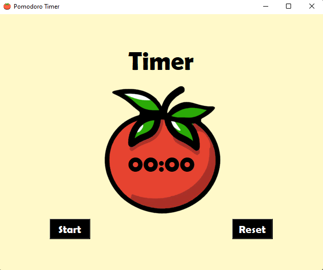
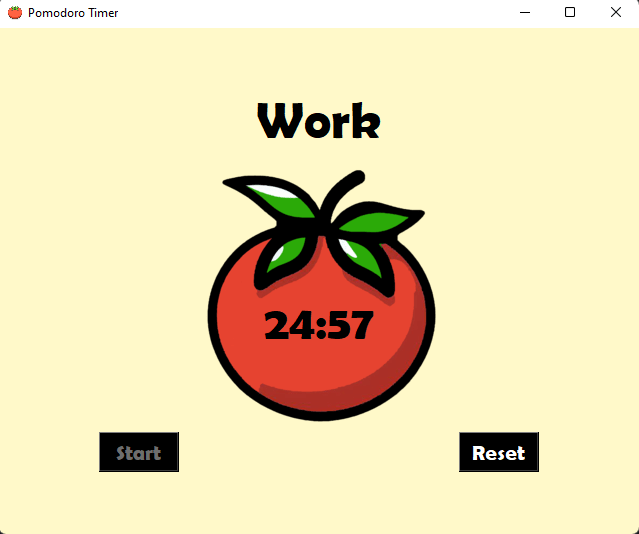
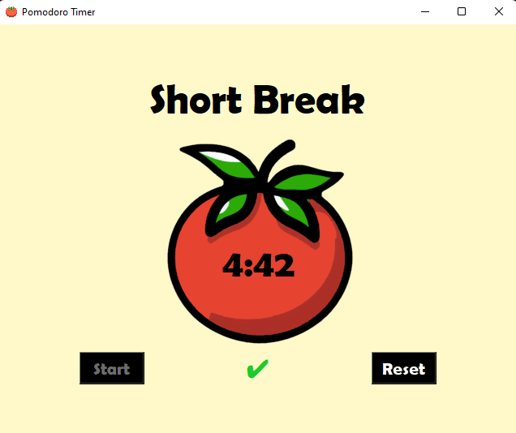
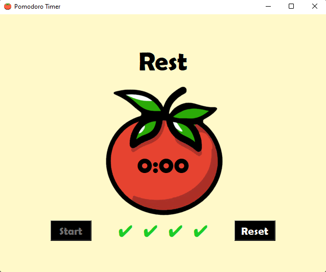
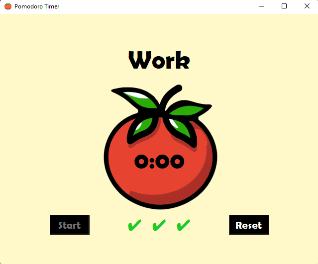

# Pomodoro Timer

## Overview

This Pomodoro Timer is a simple yet effective time management tool to boost productivity and focus. It follows the Pomodoro Technique, a time management method developed by Francesco Cirillo.

## Features

- **Work Sessions:** Four work sessions each 25 minutes long.
- **Breaks:** Short breaks between sessions, 5 minutes long.
- **Rest:** 25 minutes rest after four work sessions before beginning next round.
- **Visual Feedback:** Included visual timer and checkmarks for completed sessions.
- **Alarm:** Plays a 2-second-long alarm at the end of each session to prompt the user even when the application is run in the background.

## Screenshots
### Main Screen

### Work

### Break

### Rest

### Sessions Completed

### More Information
[To know more about the Pomodoro Technique][Read]

[Read]: https://en.wikipedia.org/wiki/Pomodoro_Technique
